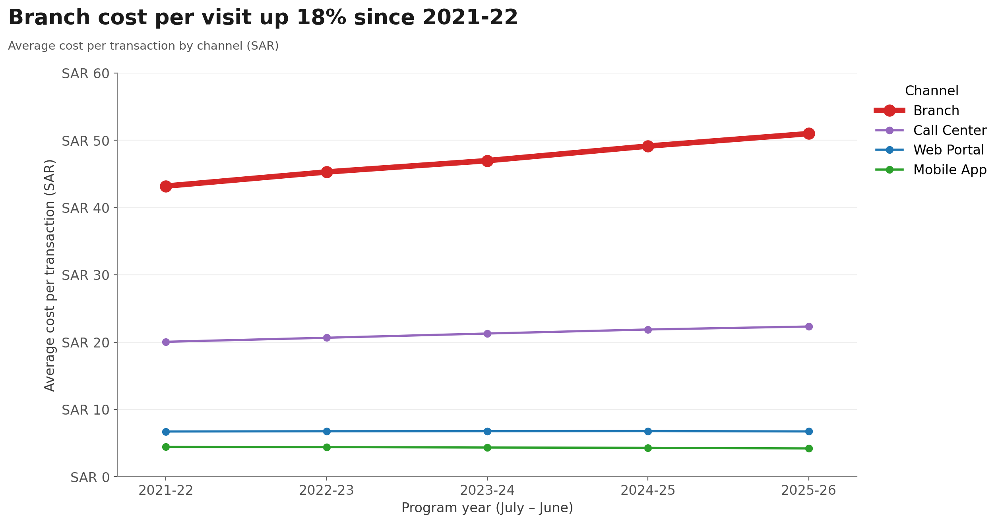
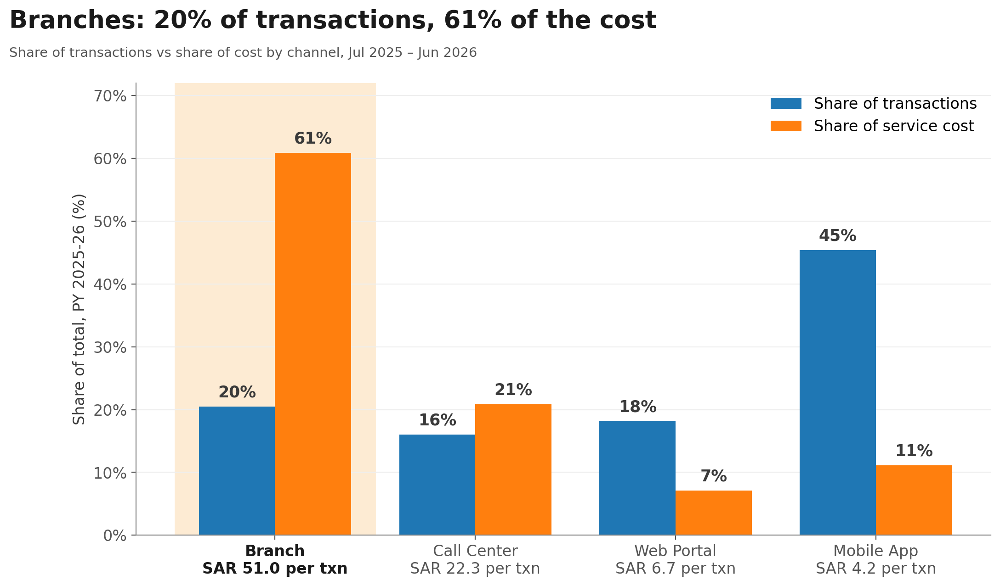

# Paying More for Emptier Branches
### Tayseer's branch network is shrinking in use but not in cost

| | |
|---|---|
| **Project name** | Paying More for Emptier Branches |
| **Course** | Data Visualization and Storytelling |
| **Student** | Abdullah Sultan Alotaibi |
| **SDAIA Academy** | https://github.com/SDAIAAcademy |

## Project description

A short visual story built on `tayseer_services.csv` (monthly government-service data, Jul 2021 – Jun 2026, 13 regions × 9 service categories × 4 channels).
As people moved to digital channels, branch visits almost halved. But the cost of each branch visit kept rising, so branches now take most of the service budget while handling a small share of the work.
The project ends with a recommendation for the program's budget owners.

---

## Decision question

> **Should the Steering Committee keep funding the branch network at its current size, or order a review to resize it before the next budget?**

## Bottom line

> **Branch visits fell 46% in four years, but each visit now costs 18% more. Branches handle 1 in 5 transactions yet take 61% of the service budget. The Steering Committee should commission a branch-network review before the next budget.**

| | |
|---|---|
| **Audience** | Tayseer Program Steering Committee (budget owners) |
| **Scope** | Branch channel vs the other three channels, all regions and categories, program years (July–June) 2021-22 to 2025-26 |

---

## Chart 1: change over time



The red Branch line climbs the most: cost per branch visit rose every year, from SAR 43.2 to SAR 51.0 (+18%). The Web Portal and Mobile App stayed flat, and the Call Center rose less (SAR 20.1 to 22.3, +11%). Over the same years, branch visits fell every year, from 56.2M to 30.2M.

## Chart 2: comparing channels



Blue = share of the work (transactions), orange = share of the money (cost). For branches the orange bar is three times the blue one: 20% of transactions, 61% of cost. The Mobile App is the opposite: 45% of transactions, 11% of cost.

---

## The story

**Finding.** Tayseer's branch network is getting more expensive per visit as fewer people use it.

**Evidence.**
- Branch visits fell from **56.2M** in PY 2021-22 (Jul 2021 – Jun 2022) to **30.2M** in PY 2025-26 (Jul 2025 – Jun 2026): **−46%**.
- Over the same years, cost per branch visit rose from **SAR 43.20** to **SAR 51.00**: **+18%**.
- In PY 2025-26, branches handled **20%** of transactions but took **61%** of total service cost (SAR 1.54B of SAR 2.53B).
- The rise appears in **all 13 regions** (+16% to +20%) and **all 9 service categories** (+17% to +19%), so it is not a local problem.
- The rise is much bigger for branches than for other channels: over the same years the Mobile App got 5% *cheaper* per transaction, the Web Portal stayed flat, and the Call Center rose 11%. So a general price rise alone does not explain it, although the data cannot rule out costs that rise faster for branches (such as rent or wages).
- At PY 2021-22's cost per visit, PY 2025-26's branch visits would have cost about **SAR 236M less**.

**Recommended action.** Before the next budget cycle, commission a **branch-network review**. Find the branches whose visits fell the most, and test merging them or turning them into smaller assisted-digital service points, while keeping in-person access for people who need it. Track branch cost per visit every quarter, with PY 2021-22's SAR 43 as the first target.

**Limitation / other explanation.** One possible reason is that only the hardest cases are left in branches, which would make each visit cost more. The data does not support this well: average branch visit time *fell* from 40.0 to 35.1 minutes. Still, the data has no branch counts, staff numbers or cost breakdown, and the exact meaning of `cost_per_txn_sar` is not defined, so it shows *that* branch unit cost is rising, not exactly *why*. Branches may also serve people who cannot use digital channels, such as older or rural users, so the review should check who still relies on branches before anything closes. The trend does not prove what caused the rise.

---

## How the numbers were made

| Claim | Metric | Aggregation |
|---|---|---|
| Branch visits | `transactions` (Branch rows) | **Summed** per program year (July–June), since counts can be added. |
| Cost per visit / transaction | `cost_per_txn_sar` | Each row is an average, so I rebuild total cost (`cost_per_txn_sar × transactions`), sum it, and divide by summed transactions: a **transaction-weighted average**. Rows are never averaged directly. |
| Share of cost / transactions | total cost, `transactions` | Channel total ÷ all-channel total, for PY 2025-26. |
| Chart 1 | cost per transaction by channel | Transaction-weighted, one point per program year (full July–June years, so seasons do not distort the comparison). |

`digital_adoption_pct` is not used, so its repeated values across channels cannot cause double counting. The notebook also checks for missing values and confirms there is exactly one row per month × region × category × channel.

---

## Why these two charts

A **line chart** is the standard way to show change over time. One line per channel, with a simple legend, makes it obvious that the Branch line rises the most. A **grouped bar chart** is the simplest way to compare two measures across a few groups: each channel gets a blue bar (share of transactions) and an orange bar (share of cost), so the gap for branches is visible at a glance. Both charts start at zero and use strong, clearly different colours. The key evidence is highlighted: the Branch line is drawn thicker than the others, and the Branch bars sit on a shaded background.

## AI use and what I checked

I chose the question, the angle, the charts and the recommendation, and I used Claude (an AI assistant) as a helper to write parts of the pandas, matplotlib and Plotly code and to tidy the wording. I reviewed every step and checked the results myself: I ran the notebook in Colab, confirmed that cost is weighted by transactions and never averaged row by row, checked that the rise holds in every region and category, and matched the numbers in this README against the notebook output.

---

## Interactive dashboard

Section 7 of `Tayseer_Dashboard.ipynb` builds a one-screen interactive dashboard in Python with **Plotly**. It has a header with a **Region** dropdown, three number cards (branch cost per visit, branch visits, branch share of service cost), and five charts:

- **Middle row:** cost per transaction by channel, branch visits per year, and share of transactions vs share of cost.
- **Bottom row:** drop in branch visits by region (about −50% in Riyadh, Qassim and the Eastern Province, but only about −30% in Jazan, Najran and Al-Baha), and branch cost per visit by region (highest in Jazan, SAR 59.2).

Choosing a region switches the number cards and the middle-row charts to that region. The two ranking charts always show all 13 regions, with the chosen region outlined and marked ▶.
**To view it:** open the notebook in Google Colab and choose **Runtime → Run all**; GitHub's preview does not show interactive output.

---

## How to run

1. Go to [colab.research.google.com](https://colab.research.google.com) → **File → Open notebook → GitHub**.
2. Paste this repository's URL and open `Tayseer_Dashboard.ipynb`.
3. **Runtime → Run all.** The notebook downloads `tayseer_services.csv` from its Google Drive link automatically, rebuilds both charts in `charts/`, and shows the dashboard at the end.

**Dependencies:** pandas, numpy, matplotlib, plotly and gdown. All of them are already installed in Google Colab, so nothing needs to be installed.

## Repository contents

```
├── README.md                              ← the story
├── Tayseer_Dashboard.ipynb                ← full analysis, both charts, and the dashboard
└── charts/
    ├── chart1_cost_per_transaction.png
    └── chart2_share_of_work_vs_cost.png
```
